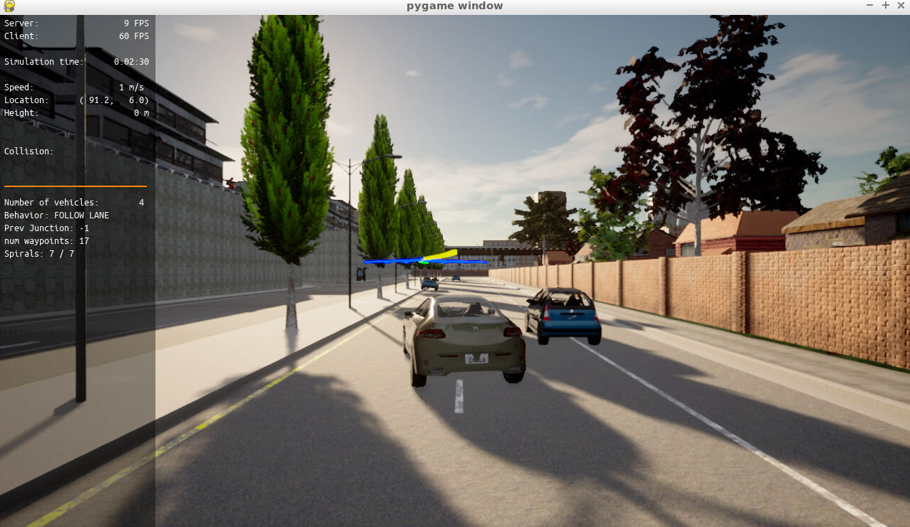
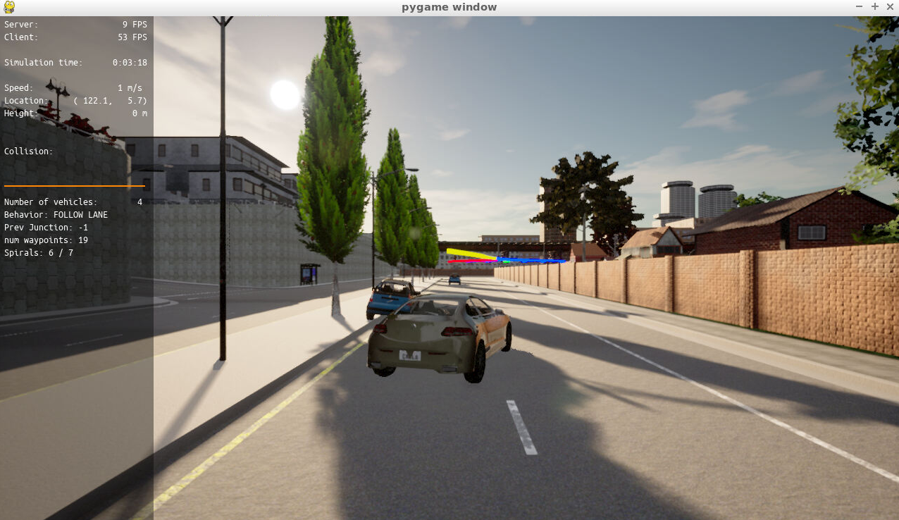

# SDCN-Motion-Planning-for-Autonmonus-vehicles-CARLA

### Motion Planning and Decision Making for Autonomous Vehicles

This project goal is to implement two of the main components of a traditional hierarchical planner: The Behavior Planner and the Motion Planner. Both will work in unison to be able to:

1. Avoidance of static objects (cars, bicycles and trucks) parked on the side of the road (but still invading the lane). The vehicle should avoid crashing with these vehicles by executing either a “nudge” or a “lane change” maneuver.

* Handle any type of intersection (3-way, 4-way intersections and roundabouts) by STOPPING in all of them (by default)
* Track the centerline on the traveling lane.

In order to accomplish this, following task will be implemented:

* Behavioral planning logic using Finite State Machines - FSM --> (starter_files)
* Static objects collision checking 
* Path and trajectory generation using cubic spirals
* Best trajectory selection through --> ``cost_function`` evaluation. This ``cost_function`` will mainly perform a collision check and a proximity check to bring cost higher as we get closer or collide with objects but maintaining a bias to stay closer to the lane center line

